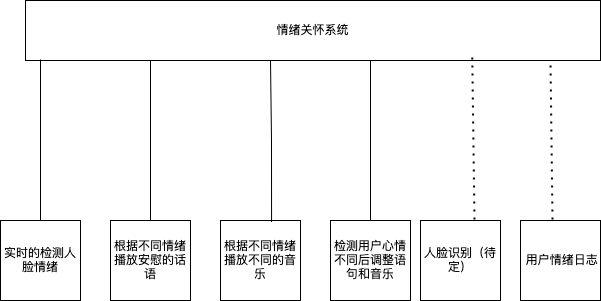

# 🎯 项目简介

本项目想要完成一个可以安慰人的实时功能，通过摄像头实时识别用户检测的情绪，对不同的情绪来对用户进行反应，与用户沟通，播放相当的音乐来舒缓用户的情绪。

## 核心功能

- 实时人脸情绪识别
- 播放安慰语音
- 播放安慰音乐
- 检测到用户心情平稳后调整语音和音乐
- 网页端交互界面展示和操作

## 技术路线

| 模块 | 功能说明 | 所用技术 / 工具 |
|------------|------------------------------|-----------------------------|
| 图像采集 | 摄像头实时画面捕捉 | OpenCV (`cv2.VideoCapture`) |
| 人脸检测 | 从视频中检测人脸区域 | OpenCV Haar Cascade / DNN |
| 情绪识别 | 将人脸图像分类为三种情绪 | `fer` 或 `DeepFace` 预训练模型 |
| 情绪平稳判断 | 通过多帧平均判断情绪是否稳定 | Python 状态缓存 + 滑动窗口 |
| 音乐播放 | 根据情绪播放对应音乐（本地音频） | `pygame.mixer` 或 `playsound` |
| 安慰语音 | 将安慰语句转为语音播放 | `edge-tts` + `pygame` 播放语音 |
| 网页界面 | 展示摄像头画面与识别结果 | Flask + HTML/CSS + Bootstrap |
| 日志记录 | 输出识别结果和状态变化到日志 | Python `logging` / 自定义记录 |

## 项目结构图

### 两个月（8周）详细作战计划

这个计划假设你已经具备Python基础语法知识。

#### **第一阶段：核心功能实现（第1-4周）**

**目标：** 在本地（非网页）完整地运行核心逻辑。

*   **第1周：环境搭建与视频流基础**
    *   **任务：**
        1.  安装Python, Pip。
        2.  创建项目文件夹，并设置好 **虚拟环境 (Virtual Environment)**。这是非常重要的一步，可以避免未来的库冲突！
        3.  安装OpenCV (`pip install opencv-python`)。
        4.  编写第一个脚本：`main_v1.py`。功能：打开摄像头，实时显示视频画面，按 'q' 键退出。
    *   **学习重点：** 虚拟环境的使用，`cv2.VideoCapture()`, `cap.read()`, `cv2.imshow()`。
    *   **周日成果：** 一个能实时显示摄像头画面的Python窗口。

*   **第2周：人脸与情绪识别集成**
    *   **任务：**
        1.  选择并安装情绪识别库，**建议先从`fer`开始**，因为它相对更轻量，安装和使用都更简单。(`pip install fer`)
        2.  修改`main_v1.py`为`main_v2.py`。在视频循环中，调用`fer`对每一帧进行情绪分析。
        3.  将检测到的人脸用方框画出，并在方框上方用`cv2.putText()`显示识别出的主要情绪（如"sad", "happy"）。
    *   **学习重点：** `fer`库的API，如何从返回结果中提取情绪，如何在OpenCV图像上绘制矩形和文本。
    *   **周日成果：** 一个能实时圈出人脸并标注情绪的视频窗口。

*   **第3周：音频交互实现**
    *   **任务：**
        1.  安装`pygame` (`pip install pygame`) 和 `edge-tts` (`pip install edge-tts`)。
        2.  预先准备好几段不同情绪的本地音乐文件（例如 `sad.mp3`, `happy.mp3`）。
        3.  使用`edge-tts`，将几句安慰的话（“别难过，听首歌吧”）生成为语音文件（`prompt.mp3`）。
        4.  修改代码为`main_v3.py`。根据第2周识别出的情绪，用`pygame.mixer`播放对应的语音提示和背景音乐。
    *   **学习重点：** `pygame.mixer`的初始化、加载、播放、停止。`edge-tts`的命令行或Python API用法。
    *   **周日成果：** 程序能根据你的表情变化，自动播放不同的语音和音乐。

*   **第4周：逻辑优化与稳定化**
    *   **任务：**
        1.  引入`collections.deque`来实现滑动窗口，平滑情绪判断结果。
        2.  设计并实现你的“情绪平稳判断”逻辑。
        3.  引入`logging`模块，将情绪变化、音乐切换等关键事件记录到日志文件`app.log`中，方便调试。
    *   **学习重点：** `deque`数据结构，状态判断算法设计，Python的`logging`模块基础配置。
    *   **周日成果：** 一个鲁棒的、反应平稳的、有日志记录的核心原型程序。

---

#### **第二阶段：Web化与整合（第5-8周）**

**目标：** 将核心功能封装，并通过网页界面展示和交互。

*   **第5周：Flask入门与视频流Web化**
    *   **任务：**
        1.  安装Flask (`pip install flask`)。
        2.  学习Flask基础，编写一个最简单的Web应用，能显示 "Hello, World!"。
        3.  **攻克难点：** 实现将OpenCV的视频流通过Flask实时传输到网页上。这是这周的核心任务。
    *   **学习重点：** Flask路由，模板渲染，**HTTP流式响应（Motion JPEG）**。
    *   **周日成果：** 在浏览器里能看到一个实时显示你摄像头画面的网页。

*   **第6周：多线程整合**
    *   **任务：**
        1.  将第4周完成的核心逻辑（情绪识别、音频播放等）与第5周的Flask应用结合起来。
        2.  **攻克难点：** 学习并使用Python的`threading`模块。将耗时的情绪识别循环放到一个后台线程中。主线程运行Flask服务器。
        3.  解决线程间数据共享问题（比如用一个全局变量来存储当前帧和当前情绪，并用`threading.Lock`来保证安全访问）。
    *   **学习重点：** `threading.Thread`的创建与启动，全局变量的线程安全问题，`Lock`的使用。
    *   **周日成果：** 一个完整的应用，后台在识别情绪，网页在显示视频流，两者互不阻塞。

*   **第7周：前后端数据同步与美化**
    *   **任务：**
        1.  在Flask中添加一个新的API端点（如 `/status`），用于返回当前的情绪状态。
        2.  在前端HTML页面中，使用JavaScript (AJAX) 定时请求 `/status` 接口，并把获取到的情绪结果显示在页面上。
        3.  引入Bootstrap，对网页进行简单的布局和美化。
    *   **学习重点：** 基础JavaScript（`fetch` API），DOM操作，基础Bootstrap样式类。
    *   **周日成果：** 一个功能完整的Web应用，网页上既有视频，又有实时更新的情绪文字，界面整洁。

*   **第8周：收尾、测试与文档撰写**
    *   **任务：**
        1.  **代码冻结！** 不要再加新功能了。
        2.  全面测试所有功能，修复BUG。
        3.  清理代码，添加必要的注释。
        4.  **开始全力撰写毕业设计论文和答辩PPT。** 整理项目结构、技术路线、核心代码、实验结果等。
    *   **学习重点：** 软件测试、文档撰写能力。
    *   **周日成果：** 一个稳定可演示的项目 + 一份高质量的毕业设计文档初稿。

